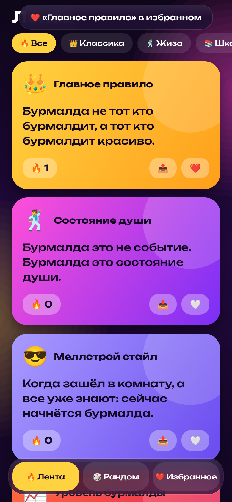
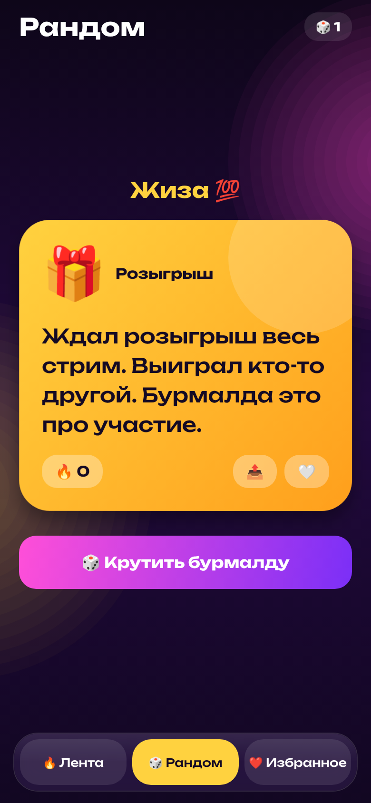
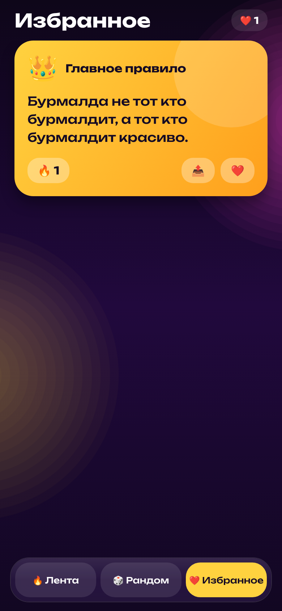

# 🕺 Бурмалда

> «Бурмалда не тот кто бурмалдит, а тот кто бурмалдит красиво»

Мем-приложение про Меллстроя и красивую бурмалду на React Native (Expo). Шрифт Unbounded, тёмная фиолетовая тема с золотым акцентом.

| Приветствие | Лента | Рандом | Избранное |
| --- | --- | --- | --- |
|  |  |  |  |

## Что умеет

- **Лента**: мемы-карточки с эмодзи по категориям (классика, жиза, школа, деньги, стрим).
- **Рандом**: кнопка «Крутить бурмалду» переворачивает карточку и выдаёт случайный мем с салютом из эмодзи.
- **Избранное**: сердечко на любой карточке, всё сохраняется на телефоне.
- 🔥 лайки с вылетающим огоньком, 📤 «Поделиться» мемом в любой мессенджер.
- **Анимации**: крутящееся кольцо логотипа, появление карточек, пружинящие кнопки, скользящий таб-бар, всплывающие уведомления, вибрация.

## APK для Android

Скачать: https://github.com/cladecarvsna-creator/kiberone/releases/download/burmalda-latest/burmalda.apk

Собирается GitHub Actions при каждом изменении папки `burmalda/`.

## Запуск

```bash
cd burmalda
npm install
npx expo start
```
