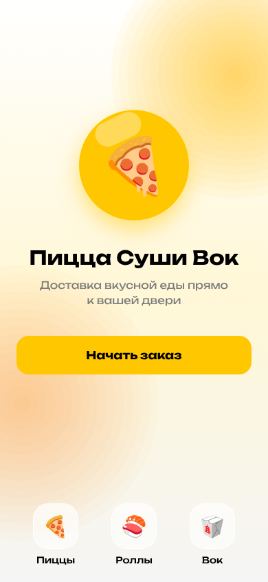
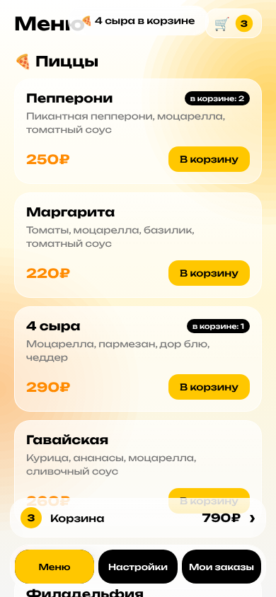
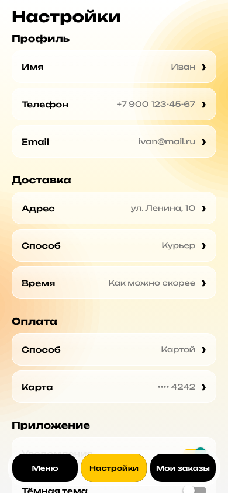
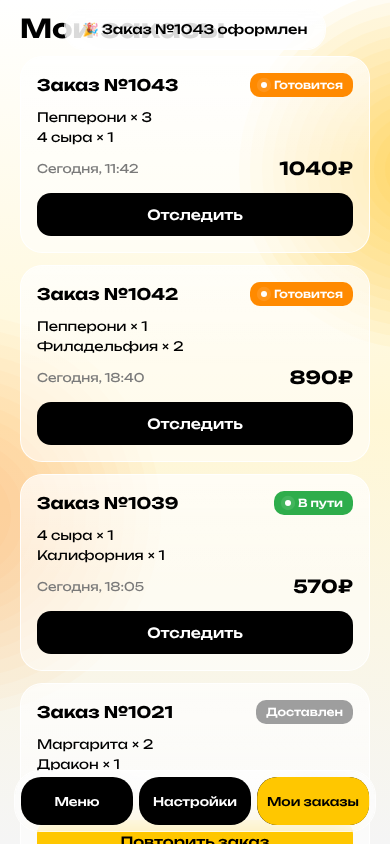
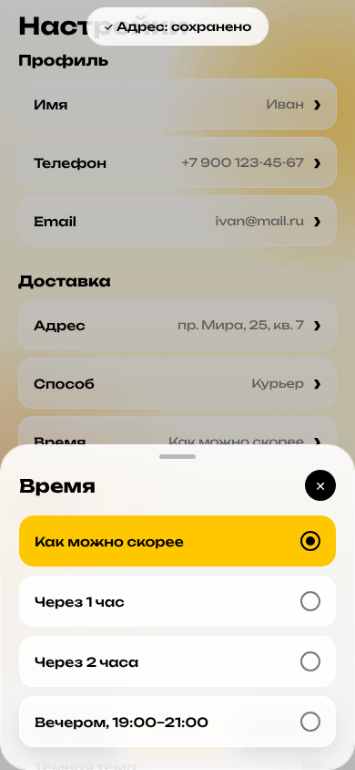
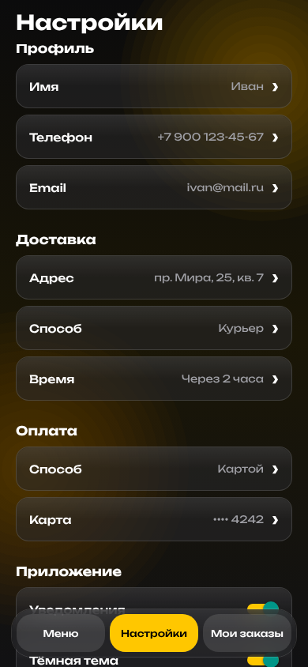

# 🍕 Пицца Суши Вок

Мобильное приложение доставки еды на React Native (Expo). Шрифт Unbounded, жёлтый акцент #FFC700.

| Приветствие | Меню | Настройки | Мои заказы |
| --- | --- | --- | --- |
|  |  |  |  |

| Корзина | Изменение настройки | Тёмная тема |
| --- | --- | --- |
|  |  |  |

## Что умеет

- **Корзина** открывается по кнопке 🛒 в меню или по плашке «Корзина» внизу: список товаров, изменение количества, итог, оформление заказа (заказ появляется в «Моих заказах»).
- **Настройки** редактируются: текстовые поля (имя, телефон, email, адрес, карта) через поле ввода, варианты (способ и время доставки, оплата, язык) через выбор, переключатели (уведомления, тёмная тема) сразу. Всё сохраняется на телефоне.
- **Мои заказы**: «Отследить» показывает этапы доставки, «Повторить заказ» кладёт тот же набор в корзину.
- **Liquid glass**: таб-бар, плашка корзины, всплывающие окна и уведомления сделаны из размытого стекла (`expo-blur`), карточки полупрозрачные поверх живого градиентного фона.
- **Анимации**: появление экранов и карточек, пружинящие кнопки, скользящий индикатор таб-бара, выезжающие окна, пульсирующий статус заказа, вибрация при нажатиях.

## Запуск

```bash
cd pizza-sushi-wok
npm install
npx expo start
```

Отсканируй QR-код приложением **Expo Go** на телефоне или нажми `w`, чтобы открыть в браузере.

## Android APK

Готовый APK собирается в GitHub Actions (`.github/workflows/pizza-sushi-wok-android.yml`) на каждый пуш и выкладывается в релиз
[android-latest](https://github.com/cladecarvsna-creator/kiberone/releases/tag/android-latest).
Открой ссылку на телефоне, скачай `pizza-sushi-wok.apk` и установи (Андроид попросит разрешить установку из неизвестных источников).

## Структура

- `App.tsx` — шрифты, переключение между приветствием и экранами с таб-баром
- `src/screens/` — экраны: `WelcomeScreen`, `MenuScreen`, `SettingsScreen`, `OrdersScreen`
- `src/sheets/` — всплывающие окна: корзина, изменение настройки, отслеживание заказа
- `src/store.tsx` — корзина, заказы и настройки (сохраняются в AsyncStorage)
- `src/components/Glass.tsx` — стеклянные поверхности
- `src/components/TabBar.tsx` — нижний стеклянный таб-бар (активный — жёлтый, неактивные — чёрные)
- `src/data.ts` — товары, стартовые заказы, описание полей настроек
- `src/theme.ts` — цвета и шрифты

## Проверка

```bash
npm run typecheck   # проверка типов
npm run build:web   # сборка веб-версии в dist/
```

Та же проверка запускается в GitHub Actions (`.github/workflows/pizza-sushi-wok.yml`).
